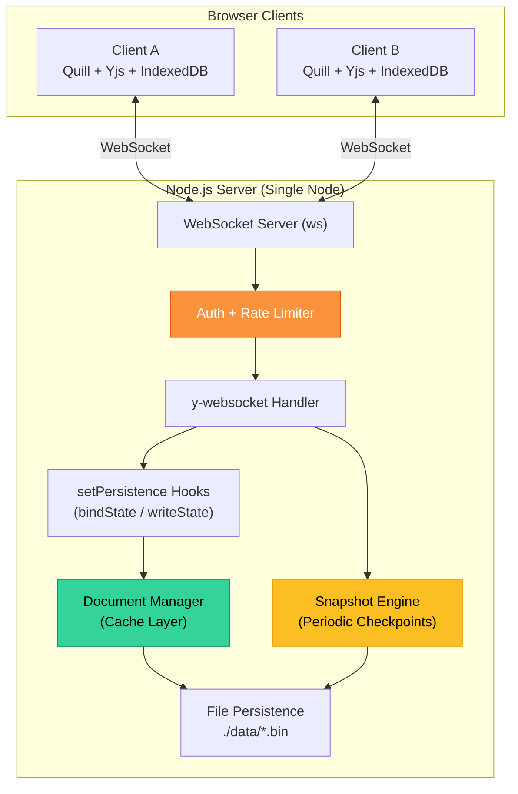

# ⚡ SyncCanvas

**Real-time collaborative document editor** with CRDT conflict resolution, offline-first architecture, and operational event logging.

🚀 **Live Demo**: [https://synccanvas-gc2d.onrender.com](https://synccanvas-gc2d.onrender.com)

[](https://synccanvas-gc2d.onrender.com)
[](https://nodejs.org/)
[](https://yjs.dev/)
[](https://developer.mozilla.org/en-US/docs/Web/API/WebSockets_API)
[](https://quilljs.com/)
[](https://www.docker.com/)
[](https://opensource.org/licenses/MIT)

> **SyncCanvas** demonstrates production-grade real-time collaboration using CRDTs — the same technology powering Notion, Figma, and JupyterLab. Multiple users edit the same document simultaneously with automatic conflict resolution, offline editing, and full edit history.

---

## ✨ Features

| Feature | Description |
|:--------|:------------|
| **🔄 CRDT Conflict Resolution** | Yjs-powered automatic merge — no central locking, no conflicts, ever |
| **⚡ Real-Time Sync** | Sub-50ms updates via WebSocket using the y-websocket protocol |
| **🏡 Dontpad-like Root URLs** | Access any document directly from the root path (e.g. `/{your-room-name}`) |
| **🚪 Room Login Portal** | Homepage portal screen lets users input their target room and custom name |
| **📴 Offline-First** | IndexedDB caches edits locally; auto-syncs when reconnected |
| **👥 Live Presence** | See collaborators' cursors, selections, and custom screen names in real-time |
| **⏪ Checkpoint Rollback** | Browse timestamped snapshots and restore to any checkpoint |
| **🛡️ Security Hardened** | Paste sanitization (DOMPurify), signed room tokens, rate limiting, origin checks |
| **💾 Hybrid Storage Persistence** | Local file storage in dev; auto-switches to MongoDB Atlas in production via `MONGODB_URI` |
| **🕹️ Network Debug Panel** | Inject latency, simulate packet loss, kill connections (`Ctrl+Shift+D`) |
| **🧠 Memory Management** | Document lifecycle GC — evicts idle documents to prevent memory exhaustion |
| **📊 Observability** | Structured JSON logging with document load/save timings and sync metrics |
| **🐳 Docker Ready** | `docker-compose up` and you're running |

---

## 🏗️ Architecture



---

## 🚀 Quick Start

### Option 1: npm (Local Dev)

```bash
git clone https://github.com/Chandan-14r/SyncCanvas.git
cd SyncCanvas
npm install
npm start
```

Open [http://localhost:3000](http://localhost:3000) in multiple browser tabs to collaborate.

### Option 2: Docker

```bash
docker-compose up
```

### Option 3: Render.com Cloud Deployment

SyncCanvas supports seamless deployment to **Render.com** (as a Web Service) with database-backed persistence:
1. Connect your repository to Render.
2. Select **Node** runtime, build command `npm install`, and start command `npm start`.
3. Set the `MONGODB_URI` environment variable to a free MongoDB Atlas connection string under Render's **Advanced Settings**.
4. Deploy! Your app is fully persistent in the cloud.

---

## 🧪 How CRDTs Work

Traditional collaborative editors use **Operational Transformation (OT)**, which requires a central server to order and transform operations. This breaks offline editing and adds latency.

**SyncCanvas uses CRDTs (Conflict-free Replicated Data Types)** via [Yjs](https://yjs.dev/):

1. Each client maintains a local copy of the document (`Y.Doc`)
2. Edits are encoded as CRDT operations with unique IDs based on client ID + logical clock
3. Operations are commutative and idempotent — they can be applied in any order and still converge
4. When clients sync (via WebSocket or on reconnect), Yjs automatically merges all operations
5. **Result**: Every client converges to the exact same document state — guaranteed, mathematically

### Why CRDT over OT?

| | CRDT (Yjs) | OT (Google Docs-style) |
|:---|:---|:---|
| **Central server required?** | No — peer-to-peer capable | Yes — server must order operations |
| **Offline editing?** | Native — merge on reconnect | Difficult — requires buffering + rebasing |
| **Conflict resolution** | Automatic, deterministic | Server-dependent transformation |
| **Latency** | Local-first, sync async | Depends on server round-trip |
| **Complexity** | Library handles it (Yjs) | Must implement transform functions |

---

## 🛡️ Security

### Input Sanitization
- **Paste/import HTML** is sanitized via DOMPurify before entering Quill's delta converter
- **Quill Delta** is the canonical document format — the app never stores or trusts arbitrary HTML
- No `innerHTML` for dynamic content — all rendering goes through Quill's safe pipeline or DOM APIs

### WebSocket Hardening
- **Origin checks** on WebSocket upgrade requests
- **Signed room tokens** (HMAC-SHA256) with expiry
- **Rate limiting** — per-IP sliding window (10 connections/minute)
- **Payload size limits** — messages over 1MB are rejected

> 💡 Collaborative editors are easy DoS targets even if XSS is handled. An unprotected WebSocket endpoint is an open door for abuse.

---

## ⚠️ Scaling Constraints

> **This is a single-node architecture.** The in-memory y-websocket server does not support horizontal scaling. All connected clients for a document must be on the same server instance.

### To scale horizontally, you would need to:
1. Replace the in-memory document pool with a shared persistence layer (e.g., [`y-redis`](https://github.com/yjs/y-redis))
2. Use a pub/sub system (Redis, NATS) to broadcast CRDT updates between server instances
3. Implement sticky sessions or a routing layer to direct clients to the correct server

This is documented honestly because understanding scaling constraints is more impressive to reviewers than pretending they don't exist.

---

## 🕹️ Network Debug Panel

Press `Ctrl+Shift+D` to open the hidden debug panel:

- **Latency Injection**: 0–2000ms delay on outgoing WebSocket messages
- **Packet Loss**: 0–50% random drop rate
- **Connection Kill**: Force-disconnect the WebSocket

This proves your CRDT and offline queueing work under real-world network conditions — not just on localhost.

---

## 📁 Project Structure

```
syncanvas/
├── server/
│   ├── index.js               # Express + ws + y-websocket server
│   ├── documentManager.js     # Cache layer + GC eviction
│   ├── persistence.js         # Yjs binary file I/O
│   ├── snapshots.js           # Periodic checkpoints + bounded update log
│   ├── auth.js                # Signed tokens + rate limiting
│   └── logger.js              # Structured JSON logging
├── public/
│   ├── index.html             # Main editor UI
│   ├── css/style.css          # Premium glassmorphic design system
│   └── js/
│       ├── app.js              # Application controller + URL router
│       ├── editor.js           # Quill + Yjs CRDT binding
│       ├── presence.js         # Live cursor awareness
│       ├── offline.js          # IndexedDB offline cache
│       ├── rollback-ui.js      # Checkpoint rollback UI
│       └── debug.js            # Network jitter simulator
├── data/                       # Document storage (gitignored)
├── Dockerfile
├── docker-compose.yml
└── package.json
```

---

## 🔮 Future Roadmap

- **Yjs Subdocuments** — lazy loading for large workspaces, multi-page docs, embedded canvases
- **Multi-node via y-redis** — distributed persistence + pub/sub for horizontal scaling
- **Comments & Annotations** — Yjs Maps scoped via subdocuments
- **Database Persistence** — PostgreSQL/MongoDB for production-scale document management

---

## 📊 Design Decisions & Tradeoffs

| Decision | Choice | Rationale |
|:---------|:-------|:----------|
| Conflict resolution | CRDT (Yjs) | Convergence guarantees; natural offline-first; no central transform server |
| Persistence | File-based / MongoDB Hybrid | Zero-dependency locally; MongoDB Atlas on Render for free cloud persistence |
| Scaling | Single-node MVP | Honest constraint; y-websocket's in-memory model doesn't scale horizontally |
| Event history | Snapshots + bounded log | Full replay becomes expensive; snapshots give O(1) restore |
| Security | Paste sanitization + WS hardening | Sanitize at entry points; lock down the upgrade path |
| Editor | Quill 2.0 | Battle-tested; native Yjs binding; rich formatting |
| Framework | Vanilla JS | Demonstrates raw skill; no framework magic to hide behind |

---

## 📄 License

MIT
