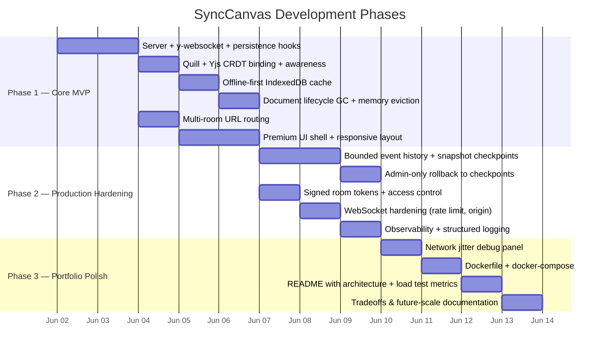
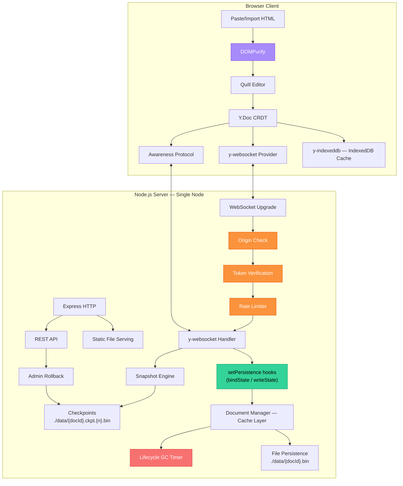

# Implementation Plan v2 — SyncCanvas: Real-Time Collaborative Editor

> Interview-ready. Production-constrained. Portfolio-optimized.

## Goal

Build **SyncCanvas**, a real-time collaborative document editor that demonstrates mastery of CRDTs, distributed state, networking, offline-first architecture, and security hardening — with honest scaling constraints and realistic production tradeoffs. Designed to survive recruiter scrutiny and technical deep-dives.

---

## Design Principles

1. **Lean core, extend only when needed** — use official Yjs integration hooks before writing custom sync plumbing
2. **Honest constraints over impressive lies** — label single-node limitations explicitly; show you know what would change at scale
3. **Security by default** — lock down the WebSocket upgrade path, sanitize untrusted input at entry points, not everywhere
4. **Phased delivery** — ship a working MVP, then layer complexity with clear justification

---

## Phased Roadmap



| Phase | Scope | Ships When |
|:------|:------|:-----------|
| **Phase 1** | Single document per room, snapshot persistence via official hooks, memory eviction, multi-room routing, offline-first, premium UI | Core functionality complete |
| **Phase 2** | Bounded event history with sampled checkpoints, admin-only rollback with preview-on-select, signed room tokens, WebSocket hardening, observability | Production hardening complete |
| **Phase 3** | Network jitter debug panel, Docker deployment, professional README with load test metrics, tradeoffs documentation | Portfolio-ready |

> [!NOTE]
> **Future Phase (not built now)**: Yjs subdocuments for large workspaces, comments, embedded canvases, Redis pub/sub for multi-node horizontal scaling.

---

## Architecture Overview



> [!IMPORTANT]
> **Single-Node Architecture**: This server uses an in-memory document pool with file-based persistence. It is explicitly **not designed for horizontal scaling**. Scaling to multiple server instances would require replacing the in-memory document pool with a shared persistence layer (e.g., Redis pub/sub via `y-redis`, or a database-backed provider). This is documented honestly in the README.

---

## Proposed Changes

Project root: `C:\Users\crs14\.gemini\antigravity\scratch\syncanvas\`

### Project Structure

```
syncanvas/
├── server/
│   ├── index.js               # Express + raw ws + y-websocket with setPersistence hooks
│   ├── documentManager.js     # Cache layer over persisted Yjs state + GC eviction
│   ├── snapshots.js           # Periodic compact snapshots + bounded recent update log
│   ├── persistence.js         # Yjs binary file I/O (read/write .bin files)
│   ├── auth.js                # Lightweight signed room tokens + origin checks
│   └── logger.js              # Structured JSON logging + metrics counters
├── public/
│   ├── index.html             # Main collaborative editor UI
│   ├── css/
│   │   └── style.css          # Premium design system
│   └── js/
│       ├── app.js              # Application controller + URL router
│       ├── editor.js           # Quill + Yjs binding + paste sanitization
│       ├── presence.js         # Yjs native awareness — cursors + users
│       ├── offline.js          # y-indexeddb + connection state management
│       ├── rollback-ui.js      # Checkpoint list + preview-on-select rollback
│       └── debug.js            # Network jitter/latency simulator
├── data/                       # Binary document storage + checkpoint files
├── package.json
├── Dockerfile
├── docker-compose.yml
├── .gitignore
└── README.md
```

---

### Phase 1 — Core MVP

---

#### [NEW] [server/index.js](file:///C:/Users/crs14/.gemini/antigravity/scratch/syncanvas/server/index.js)

- Express HTTP server serving `public/` static files
- Raw `ws` WebSocket server — **no Socket.io** (y-websocket already handles the full sync + awareness protocol)
- **Official y-websocket persistence hooks**:
  ```js
  const { setPersistence } = require('y-websocket/bin/utils');
  setPersistence({
    bindState: async (docName, ydoc) => {
      // Load persisted binary state from disk into the Y.Doc
      const state = await persistence.readDocument(docName);
      if (state) Y.applyUpdate(ydoc, state);
    },
    writeState: async (docName, ydoc) => {
      // Persist Y.Doc binary state to disk when document is cleaned up
      await persistence.writeDocument(docName, Y.encodeStateAsUpdate(ydoc));
    }
  });
  ```
  This aligns with the intended Yjs integration model instead of reimplementing sync lifecycle behavior
- **Multi-room document isolation**: The y-websocket utility already scopes sync by room name. The client connects with the document ID from the URL path as the room name
- REST API:
  - `GET /api/documents` — list persisted documents
  - `GET /api/checkpoints/:docId` — list available restore points
  - `POST /api/rollback/:docId/:checkpointId` — admin-only restore to checkpoint
  - `GET /api/token/:docId` — issue a lightweight signed room token

---

#### [NEW] [server/documentManager.js](file:///C:/Users/crs14/.gemini/antigravity/scratch/syncanvas/server/documentManager.js)

Framed as a **cache layer over persisted Yjs state**, not the source of truth. Disk is always canonical.

- **Cache Pool**: `Map<docId, { ydoc, connectionCount, lastActivity, memoryBytes }>`
- **Cache Miss**: When `bindState` fires for a room with no cached doc, load from `./data/{docId}.bin`. If no file exists, start fresh
- **Connection Tracking**: Increment on WebSocket open, decrement on close
- **Eviction Policy**: Every 60s, scan the pool. If `connectionCount === 0` and idle > 5 minutes:
  1. Call `writeState` to persist final state
  2. `ydoc.destroy()` to release memory
  3. Remove from cache
- **Memory Pressure Metric**: Track approximate byte size per cached document. Log warnings when total pool exceeds a configurable threshold
- **Future path**: Yjs subdocuments (`Y.Doc.getSubdocs()`) enable lazy loading/unloading of sections for very large workspaces, multi-page docs, or embedded canvases

---

#### [NEW] [server/persistence.js](file:///C:/Users/crs14/.gemini/antigravity/scratch/syncanvas/server/persistence.js)

- `readDocument(docId)` → reads `./data/{docId}.bin`, returns `Uint8Array` or `null`
- `writeDocument(docId, update)` → writes `Uint8Array` to `./data/{docId}.bin`
- `listDocuments()` → scans `./data/` for `.bin` files, returns metadata
- `deleteDocument(docId)` → removes `.bin` and associated checkpoint files
- All I/O is `async` using `fs.promises` — non-blocking

---

#### [NEW] [public/js/editor.js](file:///C:/Users/crs14/.gemini/antigravity/scratch/syncanvas/public/js/editor.js)

- Initialize Quill with formatting toolbar (bold, italic, h1-h3, lists, code blocks, blockquote, links)
- Create `Y.Doc`, bind `Y.Text` type to Quill via `y-quill`
- Connect `WebsocketProvider` to server, scoped to `docId` room extracted from URL
- **Paste/Import Sanitization** (not "every render cycle"):
  - Hook into Quill's `clipboard` module matcher
  - Run `DOMPurify.sanitize(pastedHtml)` **before** the HTML enters Quill's delta converter
  - Quill Delta / Yjs state is the canonical format — we never trust or store arbitrary HTML
- Set awareness state: `{ name, color, cursor }`

---

#### [NEW] [public/js/presence.js](file:///C:/Users/crs14/.gemini/antigravity/scratch/syncanvas/public/js/presence.js)

- Uses **Yjs native Awareness Protocol** from `provider.awareness`
- Auto-assigns each user a color from a curated 12-color palette
- Generates animal-based usernames (e.g., `Swift Otter`, `Quiet Falcon`)
- Renders:
  - Right sidebar: user list with color dot + name + "editing" indicator
  - In-editor: remote cursor labels via `quill-cursors`
  - Toast notifications on join/leave

---

#### [NEW] [public/js/offline.js](file:///C:/Users/crs14/.gemini/antigravity/scratch/syncanvas/public/js/offline.js)

- `y-indexeddb` provider for local CRDT state persistence
- Connection state machine: `CONNECTED → DISCONNECTED → RECONNECTING → CONNECTED`
- Visual indicators: 🟢 Online / 🟡 Reconnecting / 🔴 Offline
- When offline: edits apply to local `Y.Doc` + IndexedDB. No data loss
- When back online: CRDT auto-merges. Toast: `Sync Complete — 0 conflicts`

---

#### [NEW] [public/js/app.js](file:///C:/Users/crs14/.gemini/antigravity/scratch/syncanvas/public/js/app.js)

- **URL Router**: Parse `location.pathname` for `/doc/{id}`. If `/`, generate UUID, `history.replaceState` to `/doc/{uuid}`
- Initialize modules: editor → presence → offline → rollback UI
- Global toast notification system for connection events, errors, rollback confirmations
- Theme toggle (dark/light)
- Keyboard shortcut handler (`Ctrl+Shift+D` for debug panel)

---

#### [NEW] [public/css/style.css](file:///C:/Users/crs14/.gemini/antigravity/scratch/syncanvas/public/css/style.css)

- Premium glassmorphic dark theme with light mode toggle
- Google Fonts: `Outfit` (headings), `Inter` (body), `JetBrains Mono` (code)
- **Compact, functional UX** — this should feel like a real tool, not a demo shell:
  - Page title at app scale (not oversized hero text)
  - Text labels over ambiguous icons
  - Explicit loading, offline, and stale states in the UI
  - URL-reflective document state (doc ID visible in the top bar)
- CSS Grid layout: editor (center), presence sidebar (right), bottom drawer (collapsible)
- Micro-animations: connection pulse, user join/leave slides, toast fade-in/out
- Remote cursor styling: colored label badges positioned inline

---

#### [NEW] [public/index.html](file:///C:/Users/crs14/.gemini/antigravity/scratch/syncanvas/public/index.html)

- Top bar: document ID (from URL), connection status badge, user count, theme toggle
- Center: Quill editor (full-width, min-height viewport)
- Right sidebar: presence list (collapsible on mobile)
- Bottom drawer: checkpoint history + rollback (collapsible)
- CDN imports: Quill, Yjs, y-quill, y-websocket, y-indexeddb, DOMPurify, quill-cursors

---

### Phase 2 — Production Hardening

---

#### [NEW] [server/snapshots.js](file:///C:/Users/crs14/.gemini/antigravity/scratch/syncanvas/server/snapshots.js)

**Hybrid model**: periodic compact snapshots + bounded recent update log (NOT "store every update forever").

- **Snapshot Checkpoints**: Every N updates (configurable, default 100) or every M minutes (default 10), capture a full `Y.encodeStateAsUpdate(ydoc)` and save as `./data/{docId}.ckpt.{sequence}.bin`
- **Bounded Recent Log**: Keep only the last K updates (default 500) in memory. Older updates are compacted into the next checkpoint
- **Checkpoint Metadata**: `{ sequence, timestamp, byteSize, updateCount }` stored in `./data/{docId}.meta.json`
- **Why hybrid**: Full replay-only rollback becomes expensive on large or old documents. Snapshots provide O(1) restore to any checkpoint, with recent updates for fine-grained rollback within the current window
- **Retention Policy**: Keep last 20 checkpoints per document. Older checkpoints are pruned

---

#### [NEW] [public/js/rollback-ui.js](file:///C:/Users/crs14/.gemini/antigravity/scratch/syncanvas/public/js/rollback-ui.js)

Replaces the "continuous slider scrubbing" design with a more realistic approach:

- Fetches checkpoint list from `GET /api/checkpoints/:docId`
- Renders a **timestamped checkpoint list** (not a continuous slider) showing:
  - Checkpoint timestamp (human-readable: "2 hours ago", "Yesterday 4:30 PM")
  - Number of edits in that checkpoint window
  - Approximate document size
- **Preview on selection**: Clicking a checkpoint fetches the snapshot binary, applies it to a temporary `Y.Doc`, renders the content in a **read-only modal overlay**
- "Restore to this checkpoint" button (admin-only) calls `POST /api/rollback/:docId/:checkpointId`
- "Cancel" dismisses the preview
- **Why not a continuous slider**: Slider scrubbing requires loading and rendering the document at every intermediate position, which becomes too heavy for large documents

---

#### [NEW] [server/auth.js](file:///C:/Users/crs14/.gemini/antigravity/scratch/syncanvas/server/auth.js)

Lightweight access control — not full auth, but enough to show security thinking:

- **Signed Room Tokens**: `GET /api/token/:docId` returns a JWT-like HMAC-signed token: `{ docId, userId, role, exp }`
  - Token is passed as a query parameter on WebSocket upgrade: `ws://host/doc/xyz?token=...`
- **Origin Checks**: Validate `Origin` header on WebSocket upgrade requests. Reject connections from unknown origins
- **Rate Limiting**: Per-IP connection rate limit (max 10 connections/minute) using a simple in-memory sliding window
- **Payload Size Limits**: Reject WebSocket messages exceeding 1MB (prevents abuse via massive document uploads)
- **Roles**: `editor` (can edit), `viewer` (read-only awareness), `admin` (can trigger rollback)

---

#### [NEW] [server/logger.js](file:///C:/Users/crs14/.gemini/antigravity/scratch/syncanvas/server/logger.js)

Structured observability — not just `console.log`:

- JSON-formatted log lines: `{ timestamp, level, event, docId, userId, durationMs, ... }`
- **Metrics Counters** (logged periodically):
  - Active documents in memory
  - Total WebSocket connections
  - Reconnect count
  - Failed sync count
  - Document load/save timings (p50, p95)
  - Memory usage per document
- Log levels: `debug`, `info`, `warn`, `error`
- Writes to stdout (container-friendly)

---

### Phase 3 — Portfolio Polish

---

#### [NEW] [public/js/debug.js](file:///C:/Users/crs14/.gemini/antigravity/scratch/syncanvas/public/js/debug.js)

Network Jitter/Latency Simulator — the portfolio "cheat code":

- Toggle via `Ctrl+Shift+D`
- Controls:
  - **Latency**: 0ms–2000ms slider — delays outgoing WebSocket messages via `setTimeout`
  - **Packet Loss**: 0%–50% slider — randomly drops outgoing updates via `Math.random()`
  - **Connection Kill**: Force-disconnect WebSocket
- Monkey-patches the `WebsocketProvider` send path
- Live metrics: current latency, messages sent/dropped, sync lag
- **Why**: Proves the app works under real network conditions, not just localhost

---

#### [NEW] [Dockerfile](file:///C:/Users/crs14/.gemini/antigravity/scratch/syncanvas/Dockerfile)

```dockerfile
FROM node:20-alpine
WORKDIR /app
COPY package*.json ./
RUN npm ci --production
COPY . .
EXPOSE 3000
CMD ["node", "server/index.js"]
```

#### [NEW] [docker-compose.yml](file:///C:/Users/crs14/.gemini/antigravity/scratch/syncanvas/docker-compose.yml)

```yaml
services:
  syncanvas:
    build: .
    ports: ["3000:3000"]
    volumes: ["./data:/app/data"]
```

---

#### [NEW] [README.md](file:///C:/Users/crs14/.gemini/antigravity/scratch/syncanvas/README.md)

Professional, interview-ready README:

- **Banner + badges**: Node.js, Yjs, Quill, WebSocket, IndexedDB, Docker
- **Architecture diagram** (Mermaid — renders natively on GitHub)
- **Features** with clear explanations, not just icon lists
- **Tradeoffs Section**:
  - Why CRDT over OT (convergence guarantees, no central transform server, offline-first natural fit)
  - Why file persistence first (zero-dependency setup, good enough for single-node, easy to swap)
  - Why single-node initially (y-websocket's in-memory model, honest about scaling limits)
  - Future path: `y-redis` for multi-node, subdocuments for large workspaces
- **Security Section**: paste sanitization, WebSocket hardening, token-based room access
- **Scaling Constraints** (honest):
  > ⚠️ This is a single-node architecture. The in-memory y-websocket server does not support horizontal scaling without a shared persistence layer. For multi-node deployments, consider y-redis or a database-backed Yjs provider.
- **Load Testing Metrics** (measured and documented):
  - Max concurrent users per document
  - Reconnect behavior under load
  - Memory usage after eviction tests
  - Document save/load latency at various sizes
- **Setup**: `npm install && npm start` OR `docker-compose up`

---

## Tradeoffs & Design Decisions

| Decision | Choice | Why | Alternative Considered |
|:---------|:-------|:----|:-----------------------|
| **Conflict Resolution** | CRDT (Yjs) | Convergence guarantees without central transform server; natural offline-first fit | OT requires a central server to order operations; breaks offline editing |
| **Persistence Model** | File-based via official hooks | Zero-dependency setup; `setPersistence` aligns with Yjs integration model | MongoDB/PostgreSQL adds setup complexity for a portfolio project |
| **Scaling Model** | Single-node, in-memory | Honest constraint; y-websocket's design doesn't easily scale horizontally | y-redis for multi-node (documented as future path) |
| **Event History** | Hybrid snapshots + bounded log | Full replay becomes expensive on old/large docs; snapshots give O(1) restore | Full update history (grows unbounded, expensive replay) |
| **Security** | Paste sanitization + WS hardening | Sanitize at entry points, not everywhere; lock down the upgrade path | DOMPurify on every render (wasteful; Quill Delta is already structured) |
| **Rich Text Editor** | Quill.js | Battle-tested; native Yjs binding via y-quill; good toolbar defaults | ProseMirror (more powerful but higher complexity for portfolio scope) |
| **Framework** | Vanilla JS | Demonstrates raw frontend competency; no framework magic to hide behind | React/Svelte (adds bundling complexity, doesn't add portfolio value here) |

---

## Security Model

### Input Sanitization
- **Paste/Import path**: DOMPurify sanitizes HTML **before** it enters Quill's delta converter via clipboard module matcher
- **Canonical format**: Quill Delta and Yjs state are the source of truth — the app never stores or trusts arbitrary HTML
- **No `innerHTML`**: All dynamic content is rendered through Quill's safe rendering pipeline or DOM API methods

### WebSocket Hardening
- **Origin check**: Validate `Origin` header on upgrade requests; reject unknown origins
- **Signed room tokens**: HMAC-signed tokens with expiry; passed as query parameter on WS connect
- **Rate limiting**: Per-IP sliding window (10 connections/minute)
- **Payload size limit**: Reject messages > 1MB
- **Role-based access**: `editor`, `viewer`, `admin` roles encoded in token

### Why This Matters
> Collaborative editors are easy DoS targets even if XSS is handled. A public WebSocket endpoint without rate limiting, origin checks, or payload limits is an open door for abuse.

---

## Verification Plan

### Automated Tests
- Server starts, WebSocket handshake completes
- Document persistence: create → write → restart server → verify content survives
- Checkpoint creation: make 100+ edits → verify checkpoint file exists on disk
- GC eviction: create doc → disconnect all clients → wait 5+ min → verify doc evicted from RAM, persisted on disk
- Rate limiter: attempt 15 rapid connections from same IP → verify rejections after 10
- Payload limit: send 2MB message → verify server rejects it

### Manual Verification

#### Core Functionality
1. Open two tabs to `/doc/{same-id}` → type in one → see changes in the other instantly
2. Verify presence sidebar shows both users with colored cursors
3. Toggle dark/light theme, verify all components adapt
4. Open a new tab to `/` → verify auto-redirect to `/doc/{new-uuid}`

#### The "Chaos Monkey" Test 🐒
> Open **three** tabs to the same document. Disconnect internet on all three. Type completely different sentences in each tab. Reconnect all three simultaneously. **Verify Yjs converges all three to the exact same merged text with zero character loss.**

#### The Large Document Test 📄
> Paste a **50,000-word essay**. Verify checkpoint creation and file persistence don't cause UI blocking. Measure save/load latency.

#### The Network Chaos Test 🌐
> Open debug panel (`Ctrl+Shift+D`). Set latency to 1500ms + packet loss 20%. Type rapidly in two tabs. Verify eventual convergence.

#### Rollback Test ⏪
> Create a document. Make edits. Wait for a checkpoint. Make more edits. Open checkpoint list. Click a past checkpoint → verify read-only preview renders correctly. Confirm rollback → verify document reverts.

---

## Future Scale Path (Not Built Now)

- **Subdocuments**: `Y.Doc.getSubdocs()` enables lazy loading/unloading of document sections — reduces memory pressure for very large workspaces, multi-page docs, or embedded canvases
- **Multi-node**: Replace in-memory document pool with `y-redis` for pub/sub across multiple server instances
- **Database persistence**: Swap file-based storage for PostgreSQL/MongoDB when document count exceeds what filesystem handles well
- **Comments & annotations**: Yjs Maps alongside the main text type, scoped via subdocuments
- **Presence at scale**: Awareness protocol works peer-to-peer through the server; at scale, consider sampling or throttling awareness updates
