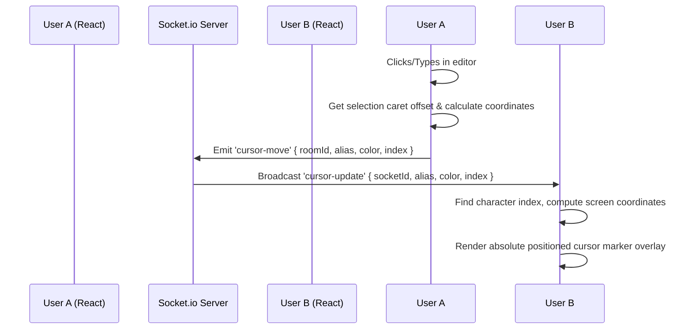

# React + Socket.io Remote Cursors Implementation Guide

Implementing remote cursors in a collaborative text editor is challenging because plain `<textarea>` elements do not expose the exact coordinates of characters. 

The most robust way to implement this without a heavy editor framework is using a **`contenteditable` div**, which allows us to use the browser's **Range and Selection APIs** to measure the exact coordinates of any character index and position a floating overlay cursor.

---

## 🏗️ 1. Architecture Overview



---

## 💾 2. Backend Implementation (Socket.io)

Add the `cursor-move` event handler to your Socket.io connection pipeline. The server acts as a low-latency relay, broadcasting cursor states to all other users in the room.

Save this in your server file (e.g. `server.js` or `sockets/editor.js`):

```javascript
// Inside your io.on('connection', (socket) => { ... }) code:

// 1. Listen for cursor movement from a client
socket.on('cursor-move', ({ roomId, alias, color, index }) => {
  if (!roomId) return;

  // Broadcast the cursor update to everyone else in the room
  socket.to(roomId).emit('cursor-update', {
    socketId: socket.id,
    alias,
    color,
    index
  });
});

// 2. Clean up remote cursors when a client disconnects
socket.on('disconnect', () => {
  // If the socket was in a room, notify others to remove their cursor representation
  if (currentRoomId) {
    socket.to(currentRoomId).emit('cursor-remove', { socketId: socket.id });
  }
});
```

---

## ⚛️ 3. Frontend Implementation (React)

Create a React component `CollaborativeEditor.jsx` that renders a `contenteditable` container, monitors cursor position, translates character indices to absolute coordinates, and displays remote user cursors.

```jsx
import React, { useRef, useState, useEffect } from 'react';
import io from 'socket.io-client';
import './Editor.css';

const SOCKET_SERVER = process.env.REACT_APP_SOCKET_URL || 'http://localhost:3000';

export default function CollaborativeEditor({ roomId, username, userColor }) {
  const editorRef = useRef(null);
  const socketRef = useRef(null);
  
  // Stores remote cursors: { [socketId]: { alias, color, index, rect: { top, left, height } } }
  const [remoteCursors, setRemoteCursors] = useState({});
  const [content, setContent] = useState('');

  // 1. Initialize Socket Connection
  useEffect(() => {
    socketRef.current = io(SOCKET_SERVER);
    
    // Join room
    socketRef.current.emit('join-room', { roomId, username });

    // Listen for remote cursor movements
    socketRef.current.on('cursor-update', ({ socketId, alias, color, index }) => {
      setRemoteCursors((prev) => {
        const coords = getCoordinatesForIndex(index);
        if (!coords) return prev; // Cursor is outside visible container
        
        return {
          ...prev,
          [socketId]: { alias, color, index, rect: coords }
        };
      });
    });

    // Remove remote cursor on user disconnect
    socketRef.current.on('cursor-remove', ({ socketId }) => {
      setRemoteCursors((prev) => {
        const next = { ...prev };
        delete next[socketId];
        return next;
      });
    });

    return () => {
      if (socketRef.current) socketRef.current.disconnect();
    };
  }, [roomId, username]);

  // 2. Recalculate all remote cursor positions on window resize or scroll
  useEffect(() => {
    const handleResizeOrScroll = () => {
      setRemoteCursors((prev) => {
        const updated = {};
        Object.keys(prev).forEach((socketId) => {
          const prevCursor = prev[socketId];
          const coords = getCoordinatesForIndex(prevCursor.index);
          if (coords) {
            updated[socketId] = { ...prevCursor, rect: coords };
          }
        });
        return updated;
      });
    };

    window.addEventListener('resize', handleResizeOrScroll);
    editorRef.current?.addEventListener('scroll', handleResizeOrScroll);
    
    return () => {
      window.removeEventListener('resize', handleResizeOrScroll);
      editorRef.current?.removeEventListener('scroll', handleResizeOrScroll);
    };
  }, [remoteCursors]);

  // 3. Helper: Calculate absolute x/y coordinates of a text character index
  const getCoordinatesForIndex = (index) => {
    const editor = editorRef.current;
    if (!editor) return null;

    const selection = window.getSelection();
    if (!selection) return null;

    // Create a range that spans from start of text to the target index
    const range = document.createRange();
    let charCount = 0;
    let nodeFound = false;

    // Deep traverse text nodes inside contenteditable to find the offset node
    function traverse(node) {
      if (nodeFound) return;

      if (node.nodeType === Node.TEXT_NODE) {
        const nextLength = charCount + node.length;
        if (index >= charCount && index <= nextLength) {
          const offset = index - charCount;
          range.setStart(node, offset);
          range.setEnd(node, offset);
          nodeFound = true;
        }
        charCount = nextLength;
      } else {
        for (let i = 0; i < node.childNodes.length; i++) {
          traverse(node.childNodes[i]);
        }
      }
    }

    traverse(editor);

    // Fallback: If index is out of bounds or empty, use editor bounds
    if (!nodeFound) {
      const editorRect = editor.getBoundingClientRect();
      return {
        top: editor.scrollTop,
        left: 0,
        height: 20
      };
    }

    // Get selection bounds for the single point range
    let rects = range.getClientRects();
    if (rects.length === 0) {
      // If client rects is empty (e.g. start of line), insert a temporary span to measure
      const span = document.createElement('span');
      span.appendChild(document.createTextNode('\u200b')); // Zero width space
      range.insertNode(span);
      rects = span.getClientRects();
      const parent = span.parentNode;
      parent.removeChild(span);
      parent.normalize(); // Merge text nodes back
    }

    if (rects.length > 0) {
      const rect = rects[0];
      const editorRect = editor.getBoundingClientRect();

      // Return coordinates relative to the editor container
      return {
        top: rect.top - editorRect.top + editor.scrollTop,
        left: rect.left - editorRect.left + editor.scrollLeft,
        height: rect.height || 18
      };
    }

    return null;
  };

  // 4. Helper: Get current local cursor index
  const getCaretIndex = () => {
    const editor = editorRef.current;
    const selection = window.getSelection();
    if (!editor || !selection || selection.rangeCount === 0) return 0;

    const range = selection.getRangeAt(0);
    const preCaretRange = range.cloneRange();
    preCaretRange.selectNodeContents(editor);
    preCaretRange.setEnd(range.endContainer, range.endOffset);
    return preCaretRange.toString().length;
  };

  // 5. Trigger event on keystroke or mouse click
  const handleEditorInteraction = () => {
    const currentIndex = getCaretIndex();
    
    // Broadcast local cursor offset
    socketRef.current.emit('cursor-move', {
      roomId,
      alias: username,
      color: userColor,
      index: currentIndex
    });
  };

  const handleInput = (e) => {
    setContent(e.target.innerHTML);
    handleEditorInteraction();
    
    // Broadcast text content modifications
    socketRef.current.emit('edit-document', e.target.innerHTML);
  };

  return (
    <div className="editor-wrapper">
      <div className="editor-container">
        {/* Absolute Remote Cursors Overlay */}
        {Object.keys(remoteCursors).map((socketId) => {
          const cursor = remoteCursors[socketId];
          if (!cursor.rect) return null;
          
          return (
            <div
              key={socketId}
              className="remote-cursor"
              style={{
                top: `${cursor.rect.top}px`,
                left: `${cursor.rect.left}px`,
                height: `${cursor.rect.height}px`,
                '--cursor-color': cursor.color
              }}
            >
              <div 
                className="remote-cursor-badge"
                style={{ backgroundColor: cursor.color }}
              >
                {cursor.alias}
              </div>
            </div>
          );
        })}

        {/* ContentEditable Text Input */}
        <div
          ref={editorRef}
          className="editable-area"
          contentEditable
          suppressContentEditableWarning
          onInput={handleInput}
          onClick={handleEditorInteraction}
          onKeyUp={handleEditorInteraction}
          placeholder="Start typing to collaborate..."
        />
      </div>
    </div>
  );
}
```

---

## 🎨 4. CSS Styling (`Editor.css`)

Positioning is key. The `.editor-container` must be set to `position: relative` so that all remote cursor markers can position themselves absolutely relative to the boundary of the writing field.

```css
.editor-wrapper {
  width: 100%;
  max-width: 800px;
  margin: 20px auto;
  border-radius: 12px;
  background: rgba(255, 255, 255, 0.05);
  backdrop-filter: blur(10px);
  border: 1px solid rgba(255, 255, 255, 0.1);
  padding: 16px;
}

.editor-container {
  position: relative; /* CRITICAL: Anchors absolute child elements */
  width: 100%;
  height: 400px;
  overflow: auto;
}

.editable-area {
  width: 100%;
  height: 100%;
  outline: none;
  font-family: 'Inter', sans-serif;
  font-size: 16px;
  line-height: 1.5;
  color: #e2e8f0;
  white-space: pre-wrap;
  word-wrap: break-word;
}

/* Remote Cursor Styling */
.remote-cursor {
  position: absolute;
  pointer-events: none; /* Allows clicks to bypass and hit the text area */
  width: 2px;
  background-color: var(--cursor-color);
  animation: cursorBlink 1s infinite alternate;
  z-index: 10;
  transition: top 0.1s ease, left 0.1s ease; /* Smooth cursor dragging */
}

.remote-cursor::after {
  content: '';
  position: absolute;
  top: 0;
  left: -2px;
  width: 6px;
  height: 6px;
  border-radius: 50%;
  background-color: var(--cursor-color);
}

/* Floating Username Tag */
.remote-cursor-badge {
  position: absolute;
  top: -18px;
  left: 0;
  padding: 2px 6px;
  border-radius: 3px 3px 3px 0;
  color: white;
  font-family: sans-serif;
  font-size: 10px;
  font-weight: 600;
  white-space: nowrap;
  opacity: 0;
  pointer-events: none;
  transition: opacity 0.2s ease;
}

/* Show the username badge on cursor movement or hover */
.remote-cursor:hover .remote-cursor-badge,
.remote-cursor {
  animation-play-state: running;
}

.remote-cursor:hover .remote-cursor-badge {
  opacity: 1;
}

/* Make badge visible for a short window during active typing */
.remote-cursor-badge {
  animation: fadeOutBadge 3s forwards;
}

/* Animations */
@keyframes cursorBlink {
  0% { opacity: 1; }
  100% { opacity: 0.3; }
}

@keyframes fadeOutBadge {
  0% { opacity: 1; }
  80% { opacity: 1; }
  100% { opacity: 0; }
}
